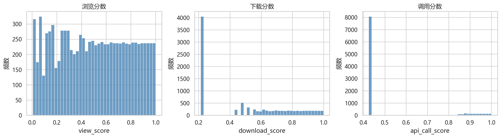
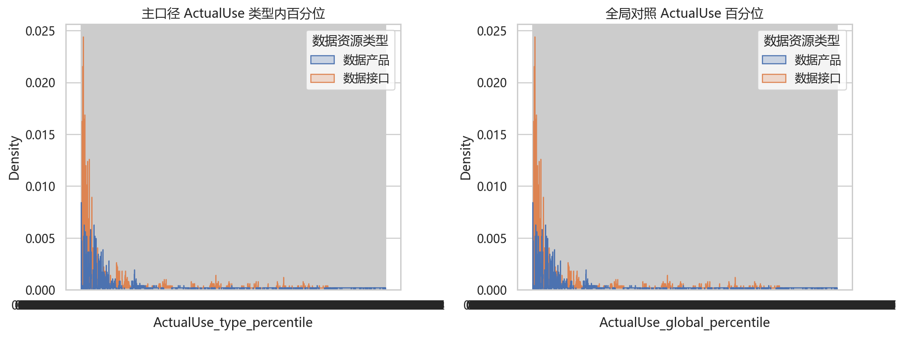
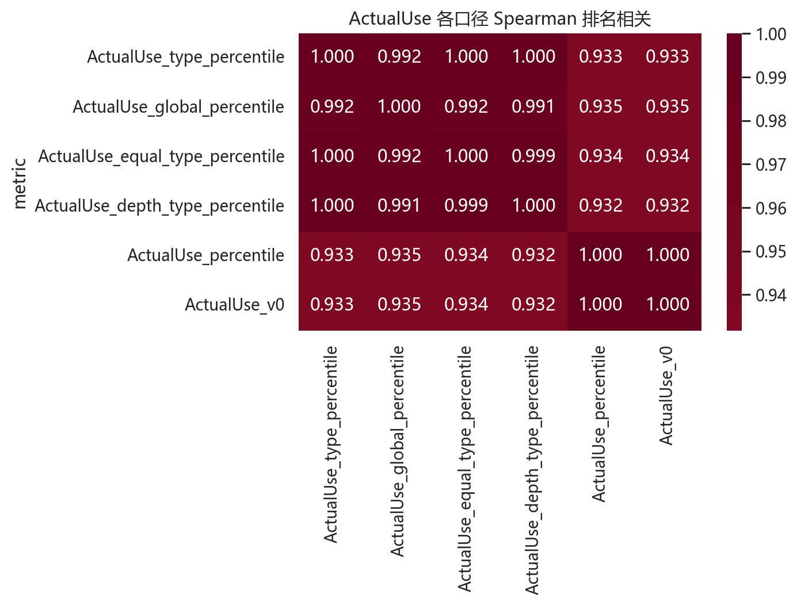
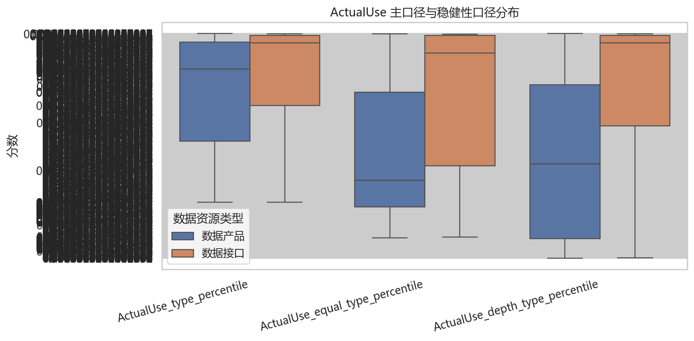

# 第5章 ActualUse 实际使用强度构造 V1.1

## 5.1 为什么不能使用固定权重

本项目不把 `0.45 × 浏览 + 0.35 × 下载 + 0.20 × 调用` 作为主口径。原因是浏览、下载和接口调用代表不同使用深度，且数据产品与数据接口的使用机制不同。若直接使用固定权重，数据接口容易因低下载被低估，数据产品也可能因低接口调用被误判。

因此，第5章主口径采用 V1.1 文档规定的 **类型适配 PCA / 因子分析思路**；固定权重只保留为“使用深度版”稳健性口径，不作为主结论。

## 5.2 ActualUse 的理论定义

ActualUse 表示公共数据资源在平台中被真实关注、获取或调用的可观测使用强度。它由三个可观测指标支撑：

| indicator   |   raw_zero_count |   raw_median |   raw_p95 |   raw_p99 |          raw_max |   score_min |   score_median |   score_max |
|:------------|-----------------:|-------------:|----------:|----------:|-----------------:|------------:|---------------:|------------:|
| 浏览量         |              120 |           72 |    3646.4 |   8209.93 | 249558           |      0.0062 |         0.5002 |           1 |
| 下载量         |             4055 |            2 |    1499.6 |   5138.49 | 179260           |      0.2125 |         0.4761 |           1 |
| 接口调用量       |             8085 |            0 |     165   |   3861.86 |      1.46979e+08 |      0.4237 |         0.4237 |           1 |

## 5.3 ActualUse 主口径：类型适配 PCA

- 样本类型分布：{'数据接口': 4917, '数据产品': 4623}
- 数据产品使用 `view_score + download_score` 提取第一主成分。
- 数据接口使用 `view_score + api_call_score` 提取第一主成分。
- PCA 第一主成分已进行方向校正，确保分数越高代表使用越强。
- `ActualUse_main = ActualUse_type_percentile`。

PCA 诊断：

| resource_type   |    n | input_cols                |   explained_variance_ratio |   direction_corr_after | loadings                                    |
|:----------------|-----:|:--------------------------|---------------------------:|-----------------------:|:--------------------------------------------|
| 数据产品            | 4623 | view_score;download_score |                     0.9155 |                 0.9996 | view_score=0.707107;download_score=0.707107 |
| 数据接口            | 4917 | view_score;api_call_score |                     0.7858 |                 0.9987 | view_score=0.707107;api_call_score=0.707107 |

指标相关性检验：

| resource_type   | actualuse_raw               | indicator      |   pearson_corr |   spearman_corr |   spearman_p |
|:----------------|:----------------------------|:---------------|---------------:|----------------:|-------------:|
| 数据产品            | ActualUse_product_pca_raw   | view_score     |         0.9568 |          0.9561 |            0 |
| 数据产品            | ActualUse_product_pca_raw   | download_score |         0.9568 |          0.9706 |            0 |
| 数据接口            | ActualUse_interface_pca_raw | view_score     |         0.8865 |          0.9473 |            0 |
| 数据接口            | ActualUse_interface_pca_raw | api_call_score |         0.8865 |          0.7777 |            0 |

## 5.4 ActualUse 稳健性口径

V1.1 保留两个稳健性口径：

- `ActualUse_equal_type_percentile`：浏览与下载/调用等权。
- `ActualUse_depth_type_percentile`：实际获取或调用权重更高，数据产品为 `0.4 view + 0.6 download`，数据接口为 `0.3 view + 0.7 call`。

主口径与稳健性口径的 Spearman 排名相关：

| metric                          |   ActualUse_type_percentile |   ActualUse_global_percentile |   ActualUse_equal_type_percentile |   ActualUse_depth_type_percentile |   ActualUse_percentile |   ActualUse_v0 |
|:--------------------------------|----------------------------:|------------------------------:|----------------------------------:|----------------------------------:|-----------------------:|---------------:|
| ActualUse_type_percentile       |                      1      |                        0.9918 |                            0.9998 |                            0.9997 |                 0.9332 |         0.9332 |
| ActualUse_global_percentile     |                      0.9918 |                        1      |                            0.9916 |                            0.9915 |                 0.9351 |         0.9351 |
| ActualUse_equal_type_percentile |                      0.9998 |                        0.9916 |                            1      |                            0.9991 |                 0.9343 |         0.9343 |
| ActualUse_depth_type_percentile |                      0.9997 |                        0.9915 |                            0.9991 |                            1      |                 0.9317 |         0.9317 |
| ActualUse_percentile            |                      0.9332 |                        0.9351 |                            0.9343 |                            0.9317 |                 1      |         1      |
| ActualUse_v0                    |                      0.9332 |                        0.9351 |                            0.9343 |                            0.9317 |                 1      |         1      |

- 主口径 vs 等权版：0.9998
- 主口径 vs 使用深度版：0.9997
- 主口径 vs 全局对照版：0.9918

Top-N 重合率：

| metric_a                  | metric_b                        |   top_pct |   top_n |   overlap_count |   overlap_rate |
|:--------------------------|:--------------------------------|----------:|--------:|----------------:|---------------:|
| ActualUse_type_percentile | ActualUse_equal_type_percentile |      0.01 |      96 |              93 |         0.9688 |
| ActualUse_type_percentile | ActualUse_equal_type_percentile |      0.05 |     477 |             463 |         0.9706 |
| ActualUse_type_percentile | ActualUse_equal_type_percentile |      0.1  |     954 |             936 |         0.9811 |
| ActualUse_type_percentile | ActualUse_equal_type_percentile |      0.2  |    1908 |            1893 |         0.9921 |
| ActualUse_type_percentile | ActualUse_depth_type_percentile |      0.01 |      96 |              88 |         0.9167 |
| ActualUse_type_percentile | ActualUse_depth_type_percentile |      0.05 |     477 |             436 |         0.914  |
| ActualUse_type_percentile | ActualUse_depth_type_percentile |      0.1  |     954 |             911 |         0.9549 |
| ActualUse_type_percentile | ActualUse_depth_type_percentile |      0.2  |    1908 |            1886 |         0.9885 |
| ActualUse_type_percentile | ActualUse_global_percentile     |      0.01 |      96 |              49 |         0.5104 |
| ActualUse_type_percentile | ActualUse_global_percentile     |      0.05 |     477 |             252 |         0.5283 |
| ActualUse_type_percentile | ActualUse_global_percentile     |      0.1  |     954 |             761 |         0.7977 |
| ActualUse_type_percentile | ActualUse_global_percentile     |      0.2  |    1908 |            1898 |         0.9948 |

## 5.5 本章结论

- 数据产品 PCA 第一主成分解释方差为 0.9155，数据接口为 0.7858。
- 方向校正后，ActualUse 与其对应使用指标均保持强正相关，说明主成分方向符合“使用越强，分数越高”的解释。
- 类型内百分位作为主口径，可以避免数据产品与数据接口之间因使用机制不同而发生系统误判。
- 等权版和使用深度版与主口径高度相关，说明 ActualUse 主口径具有较好的稳健性。
- 后续第6章 PotentialUse 和第8章 DormantScore 均应使用 `ActualUse_main / ActualUse_type_percentile` 作为正式实际使用强度口径。
