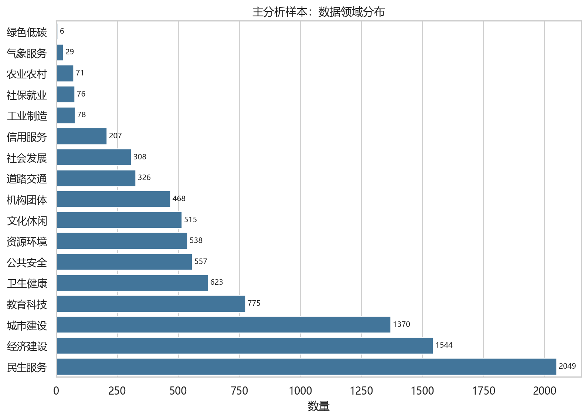
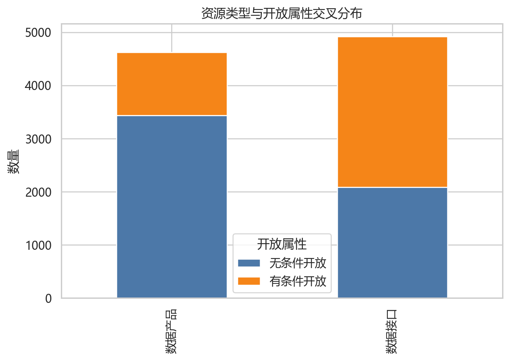
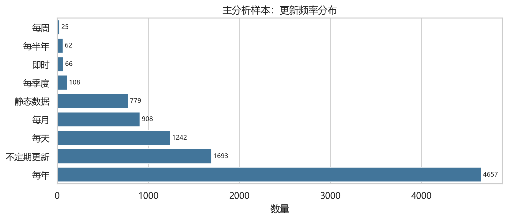
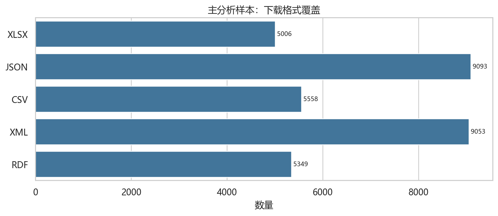
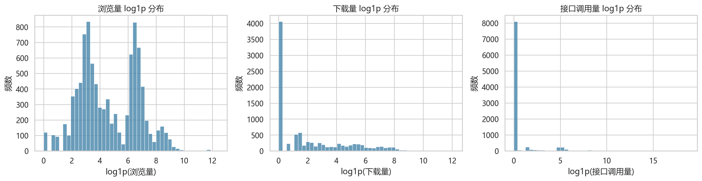
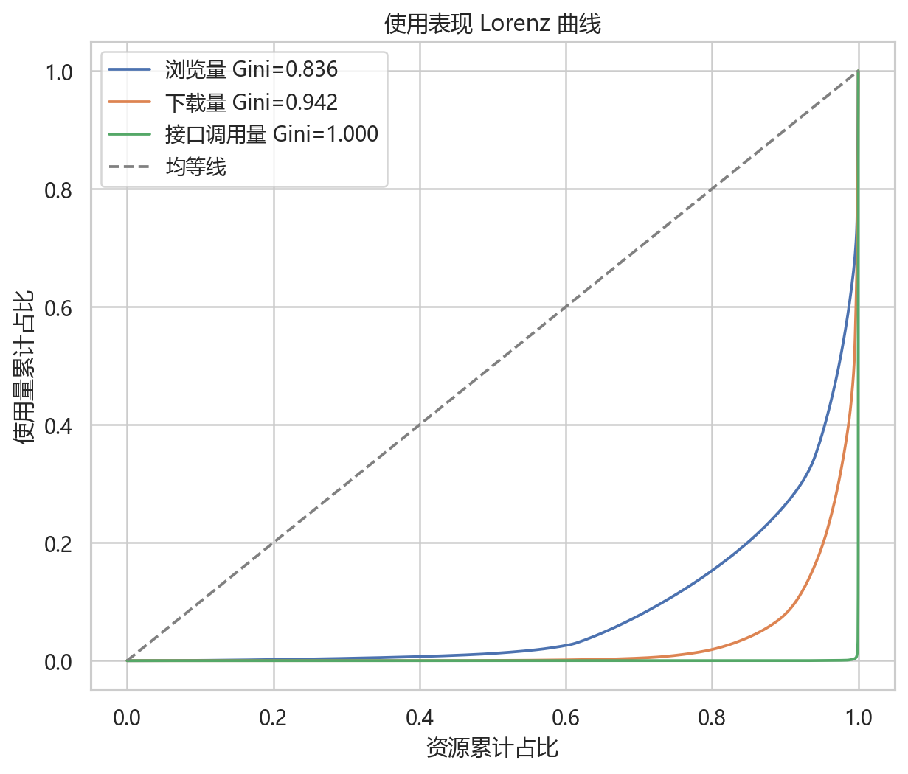
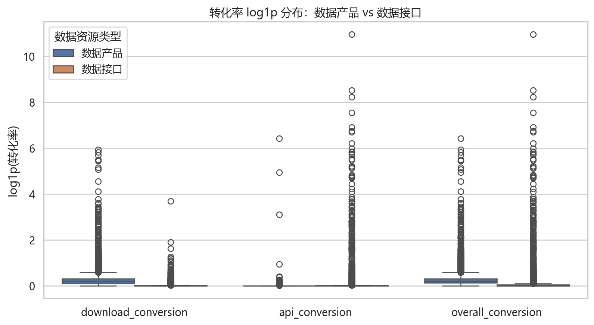
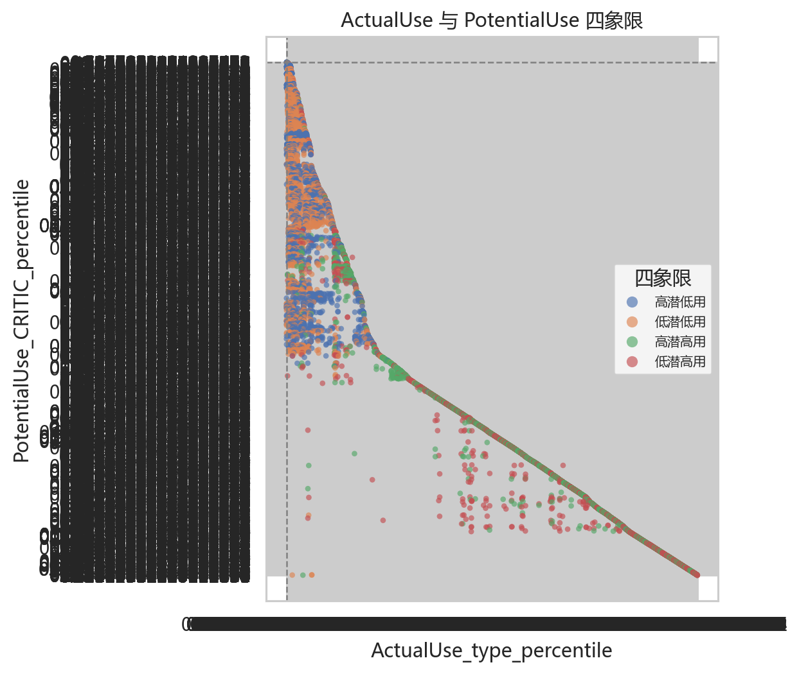
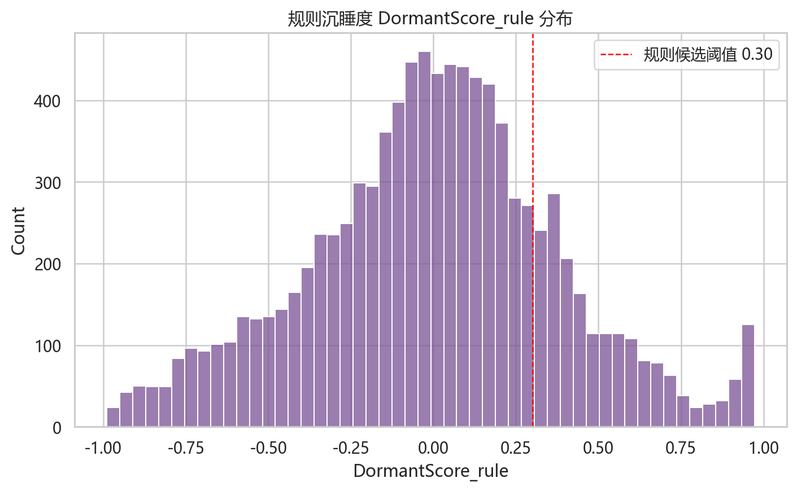
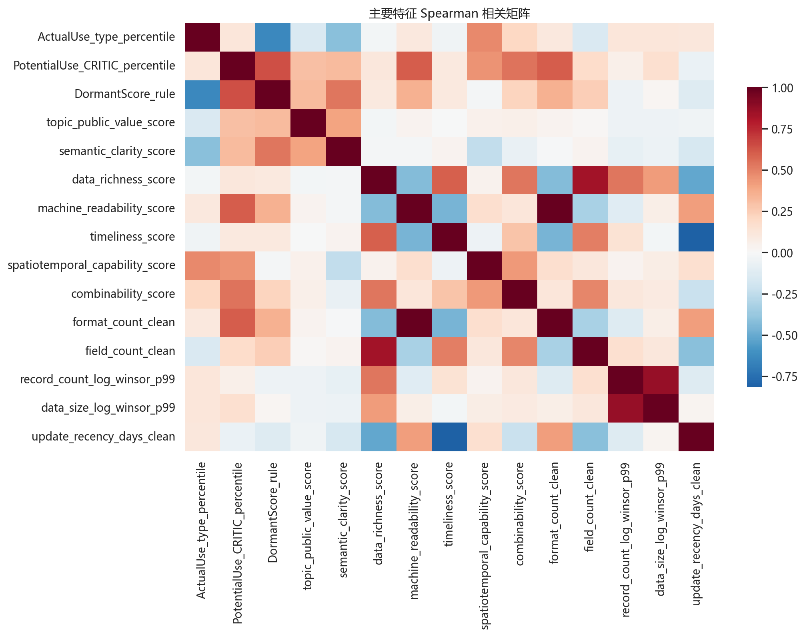

# 上海公共数据资产 EDA V1.1 报告

## 1. 样本口径

- 全量资源画像样本：9793 条
- 主分析样本：9540 条
- V1.1 特征样本：9540 条
- 规则沉睡候选：1111 条

## 2. 平台资源画像

- 主样本资源类型：{'数据接口': 4917, '数据产品': 4623}
- 主样本开放属性：{'无条件开放': 5522, '有条件开放': 4018}

主要数据领域 Top 6：

| 数据领域   |   count |   share |
|:-------|--------:|--------:|
| 民生服务   |    2049 |  0.2148 |
| 经济建设   |    1544 |  0.1618 |
| 城市建设   |    1370 |  0.1436 |
| 教育科技   |     775 |  0.0812 |
| 卫生健康   |     623 |  0.0653 |
| 公共安全   |     557 |  0.0584 |

## 3. 使用表现长尾

核心使用指标摘要：

| metric                    |   count |   zero_count |      mean |   median |       p90 |     p95 |     p99 |              max |   gini |   top1_share |   top5_share |
|:--------------------------|--------:|-------------:|----------:|---------:|----------:|--------:|--------:|-----------------:|-------:|-------------:|-------------:|
| 浏览量                       |    9540 |          120 |   877.402 |  72      | 1287.1    | 3646.4  | 8209.93 | 249558           | 0.8356 |       0.376  |       0.6186 |
| 下载量                       |    9540 |         4055 |   419.058 |   2      |  516.4    | 1499.6  | 5138.49 | 179260           | 0.9416 |       0.5656 |       0.808  |
| 接口调用量                     |    9540 |         8085 | 18741.3   |   0      |   14      |  165    | 3861.86 |      1.46979e+08 | 0.9996 |       0.9984 |       0.9997 |
| ActualUse_type_percentile |    9540 |            0 |     0.5   |   0.5001 |    0.9001 |    0.95 |    0.99 |      1           | 0.3334 |       0.02   |       0.0975 |

结论：浏览、下载、接口调用均明显长尾，下载和接口调用的零值比例尤其高；这支持 V1.1 中 `log1p + percentile + 类型适配 ActualUse` 的处理。

## 4. 转化率分析

按资源类型统计的转化率：

| 数据资源类型   |   download_conversion_count |   download_conversion_median |   download_conversion_mean |   download_conversion_max |   api_conversion_count |   api_conversion_median |   api_conversion_mean |   api_conversion_max |   overall_conversion_count |   overall_conversion_median |   overall_conversion_mean |   overall_conversion_max |
|:---------|----------------------------:|-----------------------------:|---------------------------:|--------------------------:|-----------------------:|------------------------:|----------------------:|---------------------:|---------------------------:|----------------------------:|--------------------------:|-------------------------:|
| 数据产品     |                        4623 |                       0.2298 |                     0.9685 |                  376.474  |                   4623 |                       0 |                0.1715 |              613.939 |                       4623 |                      0.2353 |                    1.14   |                  614.061 |
| 数据接口     |                        4917 |                       0      |                     0.033  |                   38.9615 |                   4917 |                       0 |               15.5338 |            57617.1   |                       4917 |                      0      |                   15.5668 |                57617.2   |

## 5. 分组差异检验

ActualUse 主口径的分组检验：

| test           | group_col   | groups         |     statistic |   p_value |   effect | effect_name     |
|:---------------|:------------|:---------------|--------------:|----------:|---------:|:----------------|
| Mann-Whitney U | 开放属性        | 无条件开放 vs 有条件开放 |   1.51511e+07 |    0      |   0.3657 | Cliff_delta     |
| Mann-Whitney U | 数据资源类型      | 数据产品 vs 数据接口   |   1.13667e+07 |    0.9935 |   0.0001 | Cliff_delta     |
| Kruskal-Wallis | 数据领域        | nan            | 740.707       |    0      |   0.0761 | epsilon_squared |
| Kruskal-Wallis | 更新频率        | nan            | 800.682       |    0      |   0.0832 | epsilon_squared |

说明：使用 Mann-Whitney U 和 Kruskal-Wallis，适合长尾和零膨胀使用数据；效应强度比单纯 p 值更适合解释。

## 6. ActualUse 与 PotentialUse

- 四象限分布：{'高潜高用': 2675, '低潜低用': 2674, '低潜高用': 2096, '高潜低用': 2095}
- 规则沉睡候选数：1111 条

规则候选按资源类型：

| 数据资源类型   |   count |
|:---------|--------:|
| 数据产品     |     811 |
| 数据接口     |     300 |

规则候选按领域 Top 10：

| 数据领域   |   count |
|:-------|--------:|
| 民生服务   |     343 |
| 公共安全   |     173 |
| 经济建设   |     156 |
| 城市建设   |     126 |
| 卫生健康   |      99 |
| 文化休闲   |      42 |
| 教育科技   |      41 |
| 资源环境   |      40 |
| 机构团体   |      39 |
| 社会发展   |      15 |

## 7. 特征关系探索

与 ActualUse 主口径 Spearman 相关的主要特征：

| feature                         |   spearman_with_actualuse |   spearman_with_potentialuse |
|:--------------------------------|--------------------------:|-----------------------------:|
| DormantScore_rule               |                   -0.6423 |                       0.6421 |
| spatiotemporal_capability_score |                    0.4768 |                       0.451  |
| semantic_clarity_score          |                   -0.4121 |                       0.3188 |
| combinability_score             |                    0.2077 |                       0.545  |
| field_count_clean               |                   -0.1552 |                       0.1822 |
| topic_public_value_score        |                   -0.1492 |                       0.2989 |
| PotentialUse_CRITIC_percentile  |                    0.1267 |                       1      |
| record_count_log_winsor_p99     |                    0.1261 |                       0.0588 |
| data_size_log_winsor_p99        |                    0.125  |                       0.1616 |
| update_recency_days_clean       |                    0.1155 |                      -0.0678 |
| machine_readability_score       |                    0.1029 |                       0.6092 |
| format_count_clean              |                    0.0994 |                       0.6095 |

## 8. 输出文件

- `tables/`：EDA 统计表 CSV
- `figures/`：EDA 图表 PNG
- `eda_v11_report.md`：本报告

## 9. 下一步

EDA 已经证明使用表现长尾明显，并完成了资源画像、转化率、分组差异和特征关系探索。下一步建议进入 `ExpectedUse` 的 K-fold out-of-fold 模型训练，输出模型残差沉睡名单并与规则候选取交集形成高置信沉睡资产。
