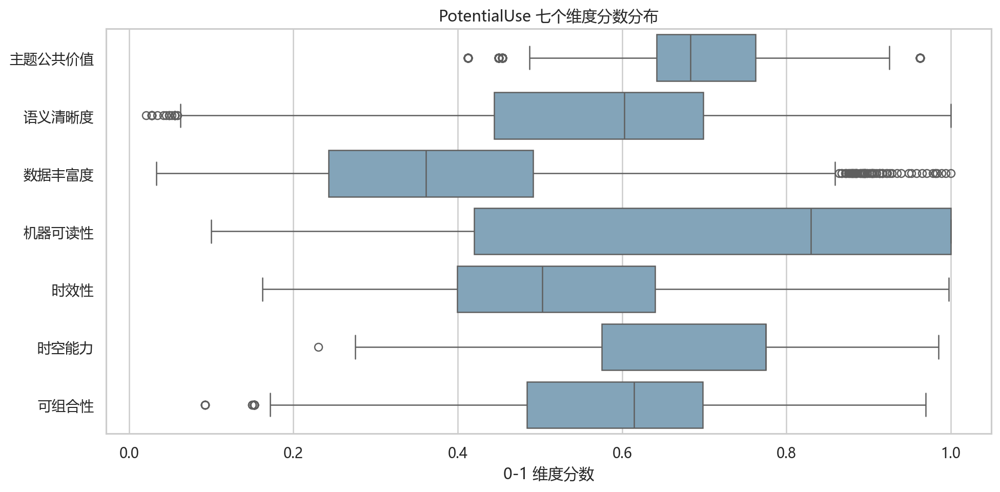
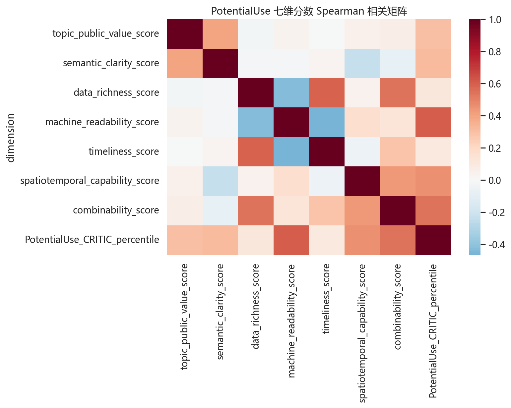
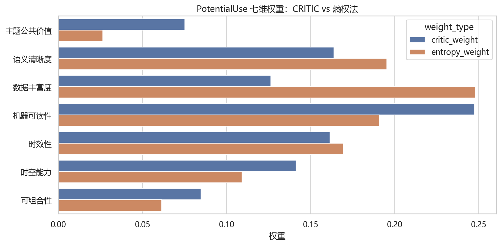
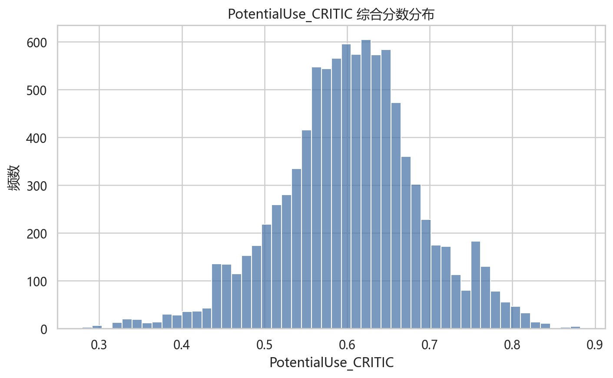
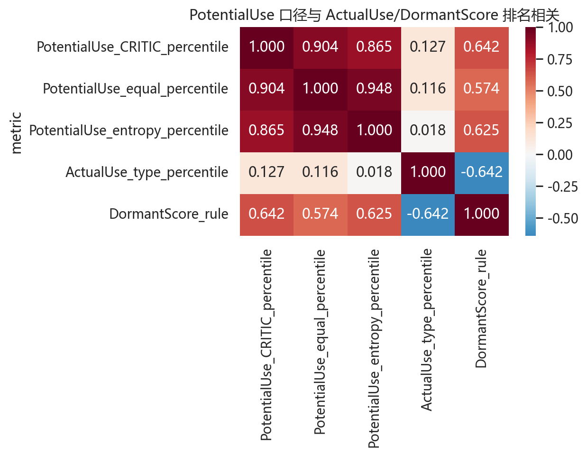
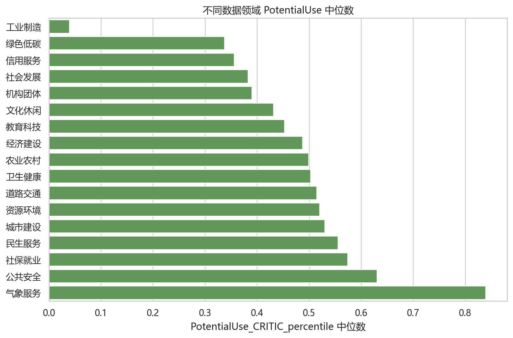
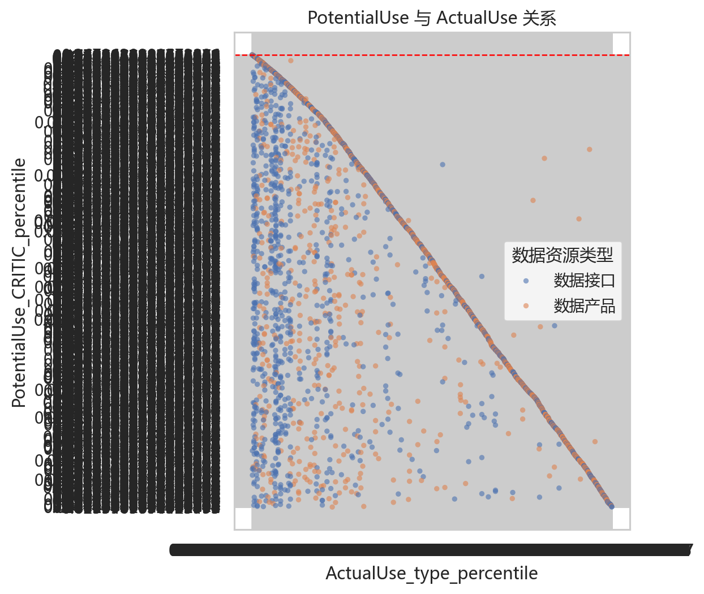

# 第6章 PotentialUse 潜在价值构造 V1.1

## 6.1 PotentialUse 的理论定义

PotentialUse 表示公共数据资源基于公共价值、内容质量、机器可读性、时效性、时空能力和可组合性所体现出的内在使用潜力。它回答的是：这个数据从自身属性看，本来是否值得被使用。

本章严格避免将浏览量、下载量、接口调用量、ActualUse 或 DormantScore 等使用表现变量纳入 PotentialUse 构造。

## 6.2 为什么需要 PotentialUse

如果只看 ActualUse，会把所有低使用资源都当成问题；PotentialUse 的作用是区分“低潜低用”和“高潜低用”。只有高潜低用才是后续沉睡资产识别的核心对象。

## 6.3 七个潜在价值维度

七个维度的实际数据分布如下：

| dimension_cn   |   mean |    std |    min |   median |    max |
|:---------------|-------:|-------:|-------:|---------:|-------:|
| 主题公共价值         | 0.6947 | 0.104  | 0.4125 |   0.6833 | 0.9625 |
| 语义清晰度          | 0.5523 | 0.2089 | 0.0208 |   0.6024 | 1      |
| 数据丰富度          | 0.3798 | 0.1769 | 0.0333 |   0.361  | 1      |
| 机器可读性          | 0.726  | 0.2876 | 0.1    |   0.83   | 1      |
| 时效性            | 0.5484 | 0.2134 | 0.1625 |   0.503  | 0.9978 |
| 时空能力           | 0.6644 | 0.1969 | 0.23   |   0.775  | 0.985  |
| 可组合性           | 0.6052 | 0.1374 | 0.0926 |   0.6145 | 0.9695 |

七维之间的相关结构用于检查信息冗余，CRITIC 会同时考虑维度变异性与冲突性。

## 6.4 为什么不能手动设定 PotentialUse 权重

本项目不采用人工固定权重作为主口径。原因是七个维度的信息量和冗余程度不同，人工权重容易被质疑。V1.1 采用“理论维度定义 + 客观赋权”：理论决定哪些维度重要，数据决定各维度在样本中提供多少有效信息。

## 6.5 PotentialUse 主口径：CRITIC 客观赋权

CRITIC 权重如下：

| dimension_cn   |    std |   conflict |   information |   critic_weight |   entropy_weight |
|:---------------|-------:|-----------:|--------------:|----------------:|-----------------:|
| 主题公共价值         | 0.104  |     5.5088 |        0.5729 |          0.0751 |           0.0262 |
| 语义清晰度          | 0.2089 |     5.9764 |        1.2485 |          0.1637 |           0.1952 |
| 数据丰富度          | 0.1769 |     5.4454 |        0.963  |          0.1263 |           0.2479 |
| 机器可读性          | 0.2876 |     6.5579 |        1.8863 |          0.2474 |           0.1909 |
| 时效性            | 0.2134 |     5.7693 |        1.231  |          0.1614 |           0.1694 |
| 时空能力           | 0.1969 |     5.4689 |        1.0768 |          0.1412 |           0.1091 |
| 可组合性           | 0.1374 |     4.7043 |        0.6463 |          0.0848 |           0.0613 |

- CRITIC 权重最高维度：机器可读性，权重 0.2474。
- 权重没有被单一维度垄断，说明七维框架仍然保持综合评价性质。

PotentialUse 综合分数摘要：

| score                           |   count |   mean |    std |    min |   median |    max |
|:--------------------------------|--------:|-------:|-------:|-------:|---------:|-------:|
| PotentialUse_CRITIC             |    9540 | 0.6039 | 0.0859 | 0.2795 |   0.6056 | 0.8822 |
| PotentialUse_CRITIC_percentile  |    9540 | 0.5    | 0.2887 | 0      |   0.5    | 1      |
| PotentialUse_equal              |    9540 | 0.5958 | 0.0781 | 0.3017 |   0.5926 | 0.8643 |
| PotentialUse_equal_percentile   |    9540 | 0.5    | 0.2887 | 0      |   0.5    | 1      |
| PotentialUse_entropy            |    9540 | 0.5612 | 0.0831 | 0.2331 |   0.5619 | 0.8489 |
| PotentialUse_entropy_percentile |    9540 | 0.5    | 0.2887 | 0      |   0.5    | 1      |

- 高潜力资源阈值 `PotentialUse_CRITIC_percentile >= 0.70` 下，共 2862 条，占主样本 30.00%。

## 6.6 PotentialUse 稳健性口径

V1.1 保留等权法和熵权法作为稳健性检验，不替代 CRITIC 主口径。

主口径与稳健性口径的排名相关：

| metric                          |   PotentialUse_CRITIC_percentile |   PotentialUse_equal_percentile |   PotentialUse_entropy_percentile |   ActualUse_type_percentile |   DormantScore_rule |
|:--------------------------------|---------------------------------:|--------------------------------:|----------------------------------:|----------------------------:|--------------------:|
| PotentialUse_CRITIC_percentile  |                           1      |                          0.9039 |                            0.865  |                      0.1267 |              0.6421 |
| PotentialUse_equal_percentile   |                           0.9039 |                          1      |                            0.9478 |                      0.1162 |              0.5745 |
| PotentialUse_entropy_percentile |                           0.865  |                          0.9478 |                            1      |                      0.0184 |              0.6251 |
| ActualUse_type_percentile       |                           0.1267 |                          0.1162 |                            0.0184 |                      1      |             -0.6423 |
| DormantScore_rule               |                           0.6421 |                          0.5745 |                            0.6251 |                     -0.6423 |              1      |

- CRITIC vs 等权法 Spearman：0.9039
- CRITIC vs 熵权法 Spearman：0.8650

Top-N 高潜资源重合率：

| metric_a                       | metric_b                        |   top_pct |   top_n |   overlap_count |   overlap_rate |
|:-------------------------------|:--------------------------------|----------:|--------:|----------------:|---------------:|
| PotentialUse_CRITIC_percentile | PotentialUse_equal_percentile   |      0.01 |      96 |              84 |         0.875  |
| PotentialUse_CRITIC_percentile | PotentialUse_equal_percentile   |      0.05 |     477 |             435 |         0.9119 |
| PotentialUse_CRITIC_percentile | PotentialUse_equal_percentile   |      0.1  |     954 |             805 |         0.8438 |
| PotentialUse_CRITIC_percentile | PotentialUse_equal_percentile   |      0.2  |    1908 |            1521 |         0.7972 |
| PotentialUse_CRITIC_percentile | PotentialUse_equal_percentile   |      0.3  |    2862 |            2287 |         0.7991 |
| PotentialUse_CRITIC_percentile | PotentialUse_entropy_percentile |      0.01 |      96 |              76 |         0.7917 |
| PotentialUse_CRITIC_percentile | PotentialUse_entropy_percentile |      0.05 |     477 |             388 |         0.8134 |
| PotentialUse_CRITIC_percentile | PotentialUse_entropy_percentile |      0.1  |     954 |             779 |         0.8166 |
| PotentialUse_CRITIC_percentile | PotentialUse_entropy_percentile |      0.2  |    1908 |            1401 |         0.7343 |
| PotentialUse_CRITIC_percentile | PotentialUse_entropy_percentile |      0.3  |    2862 |            2154 |         0.7526 |

权重扰动检验：

|   amplitude |   spearman_with_base_mean |   spearman_with_base_min |   spearman_with_base_median |   spearman_with_base_max |   top10_overlap_rate_mean |   top10_overlap_rate_min |   top10_overlap_rate_median |   top10_overlap_rate_max |   top30_overlap_rate_mean |   top30_overlap_rate_min |   top30_overlap_rate_median |   top30_overlap_rate_max |
|------------:|--------------------------:|-------------------------:|----------------------------:|-------------------------:|--------------------------:|-------------------------:|----------------------------:|-------------------------:|--------------------------:|-------------------------:|----------------------------:|-------------------------:|
|         0.1 |                    0.9978 |                   0.993  |                      0.9983 |                   0.9999 |                    0.9804 |                   0.9591 |                      0.9811 |                   0.9958 |                    0.9701 |                   0.941  |                      0.9719 |                   0.9913 |
|         0.2 |                    0.9913 |                   0.9609 |                      0.9937 |                   0.9994 |                    0.9583 |                   0.9046 |                      0.9612 |                   0.9895 |                    0.9405 |                   0.8644 |                      0.9441 |                   0.9843 |

## 6.7 实际数据中的 PotentialUse 结构

不同数据领域 PotentialUse 中位数 Top 10：

| group_value   |   count |   potential_median |   high_potential_count |   high_potential_share |
|:--------------|--------:|-------------------:|-----------------------:|-----------------------:|
| 气象服务          |      29 |             0.8391 |                     17 |                 0.5862 |
| 公共安全          |     557 |             0.6301 |                    253 |                 0.4542 |
| 社保就业          |      76 |             0.5738 |                     27 |                 0.3553 |
| 民生服务          |    2049 |             0.5554 |                    690 |                 0.3367 |
| 城市建设          |    1370 |             0.53   |                    445 |                 0.3248 |
| 资源环境          |     538 |             0.5203 |                    161 |                 0.2993 |
| 道路交通          |     326 |             0.5143 |                    106 |                 0.3252 |
| 卫生健康          |     623 |             0.5027 |                    213 |                 0.3419 |
| 农业农村          |      71 |             0.4992 |                     14 |                 0.1972 |
| 经济建设          |    1544 |             0.4874 |                    411 |                 0.2662 |

## 6.8 本章结论

- PotentialUse 已按 V1.1 文档构造为七维内在价值指标，不包含任何使用表现变量。
- CRITIC 主口径同时考虑维度差异性和冗余性，比人工权重更适合论文和建模报告表达。
- 等权法、熵权法和权重扰动结果用于稳健性检验，后续规则沉睡度仍以 `PotentialUse_CRITIC_percentile` 为正式口径。
- 下一步应进入第 8.1 的规则沉睡度正式整理：`DormantScore_rule = PotentialUse_CRITIC_percentile - ActualUse_type_percentile`，而不是直接跳到 ExpectedUse。
